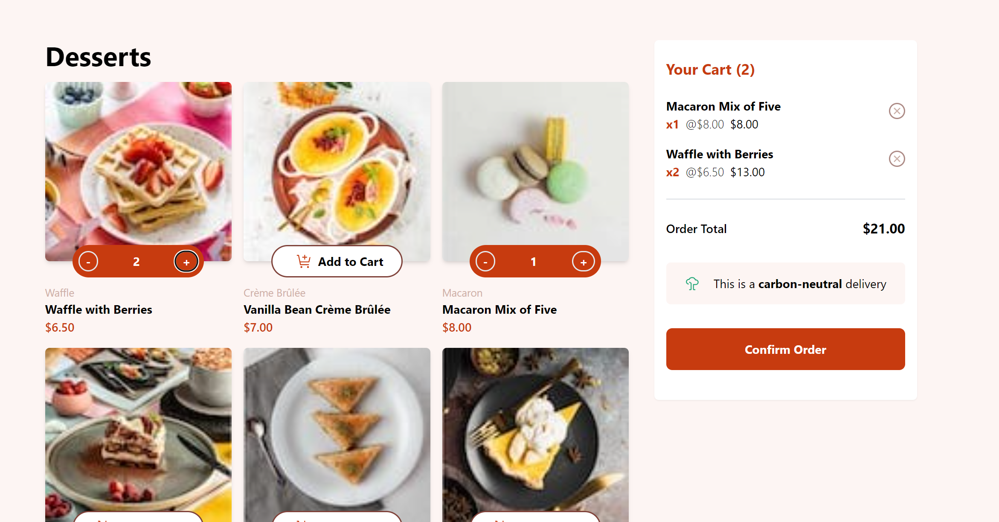
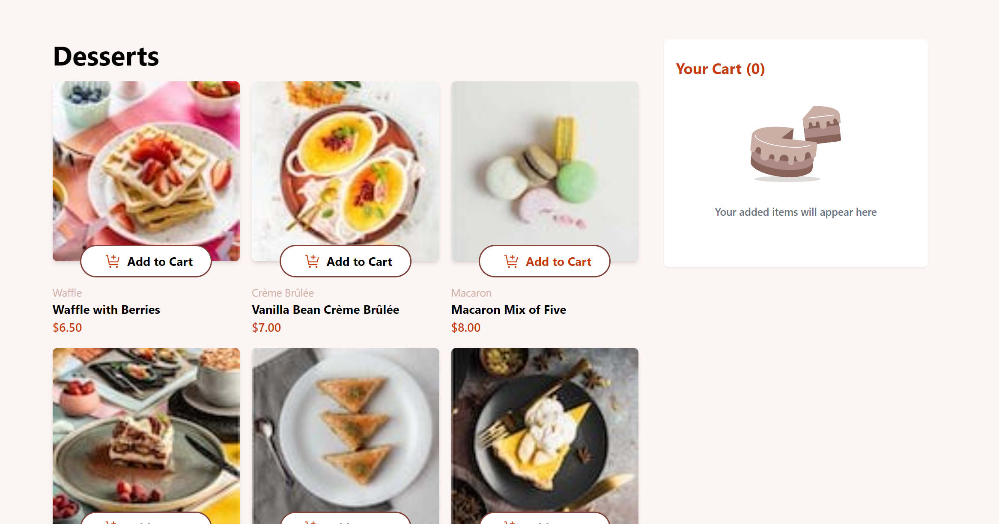

# React + Vite

# Frontend Mentor - Product list with cart solution

This is a solution to the [Product list with cart challenge on Frontend Mentor](https://www.frontendmentor.io/challenges/product-list-with-cart-5MmqLVAp_d). Frontend Mentor challenges help you improve your coding skills by building realistic projects. 

## Table of contents

- [Overview](#overview)
  - [The challenge](#the-challenge)
  - [Screenshot](#screenshot)
  - [Links](#links)
- [My process](#my-process)
  - [Built with](#built-with)
  - [What I learned](#what-i-learned)
- [Author](#author)
- [Acknowledgments](#acknowledgments)

**Note: Delete this note and update the table of contents based on what sections you keep.**

## Overview

### The challenge

Users should be able to:

- Add items to the cart and remove them
- Increase/decrease the number of items in the cart
- See an order confirmation modal when they click "Confirm Order"
- Reset their selections when they click "Start New Order"
- View the optimal layout for the interface depending on their device's screen size
- See hover and focus states for all interactive elements on the page

### Screenshot

### Links

- Solution URL: [Add solution URL here](https://your-solution-url.com)
- Live Site URL: [Add live site URL here](https://your-live-site-url.com)

## My process

### Built with

- Semantic HTML5 markup
- Tailwind
- React + Hooks
- Figma
--------------------------
- Mobile-first workflow  **I will search for it..**

### What I learned

* I have decided to use Tailwind for this project because it is going to be a one-page project.
* Today, instead of using general CSS in the index file, I realized that I could also do this in the Tailwind config file.
* UseState kullanarak bileşenlerin durumunu kontrol etmeyi öğrendim sonra da bunları set.. fonksiyonları ile kullanarak değiştirdim.
* Bir ürün eklenip çıkarıldığında hem count hem addcard'ın nasıl kontrol edildiğini anladım gibi.. 2 şeyi etkilene durumlarda usestate yapılarını daha global ortama almak lazım hatta bunun için ayrıca bi dosya oluşturulabilir
* Koşullu Render (Conditional Rendering)
  - prevState : bunla önceki durumu kopyalayıp  sadece istenilen alanı değiştirme
  - ...item   : bununla itemın içindeki tüm şeyleri alıyoruz       
  - find / map / filter / reduce
  
**->->->->PROUD OF THİS->->->->->->->->->->->->->->->->->**
setButtonStates(prevState => ({
*                ...prevState,
                [name]: { addCard: true, count: count - 1 }
            }));
*            setCartItems(cartItems.map(item =>
                item.name === name ? { ...item, count: item.count - 1 } : item
            ));
**->->->->->->->->-->->->->->->->->->->->->->->->->->->->**

If you want more help with writing markdown, we'd recommend checking out [The Markdown Guide](https://www.markdownguide.org/) to learn more.

## Author

- Website - [Basak Karadeniz](https://www.your-site.com)
- Frontend Mentor - [@yourusername](https://www.frontendmentor.io/profile/yourusername)

